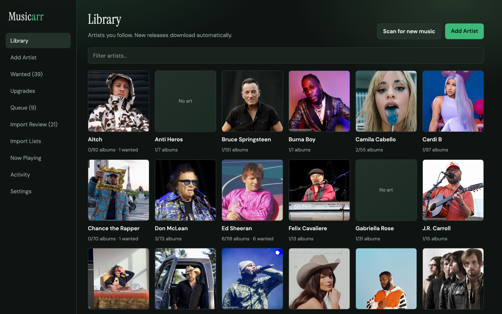
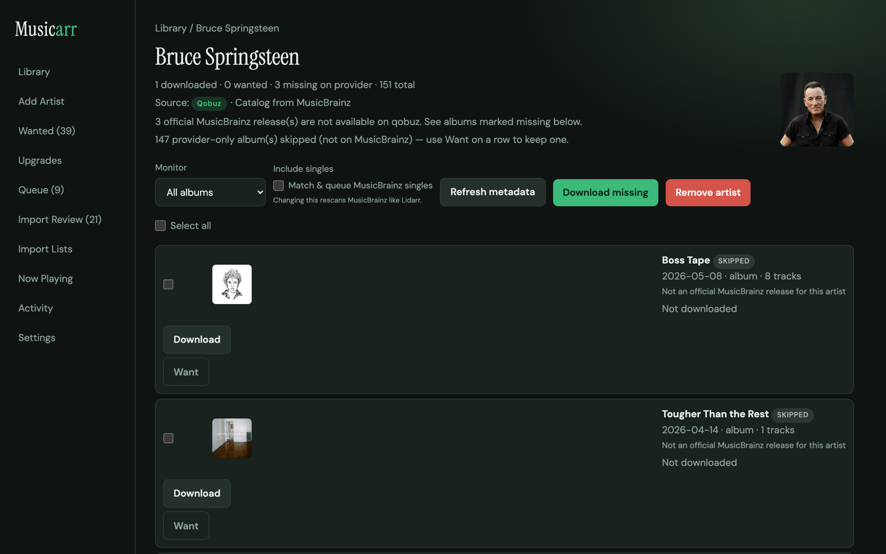
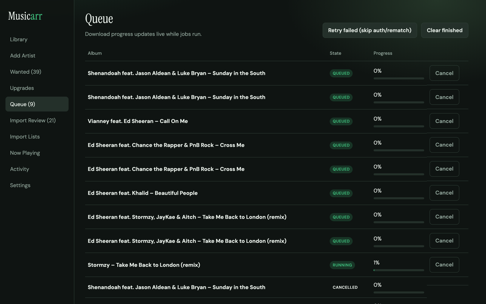
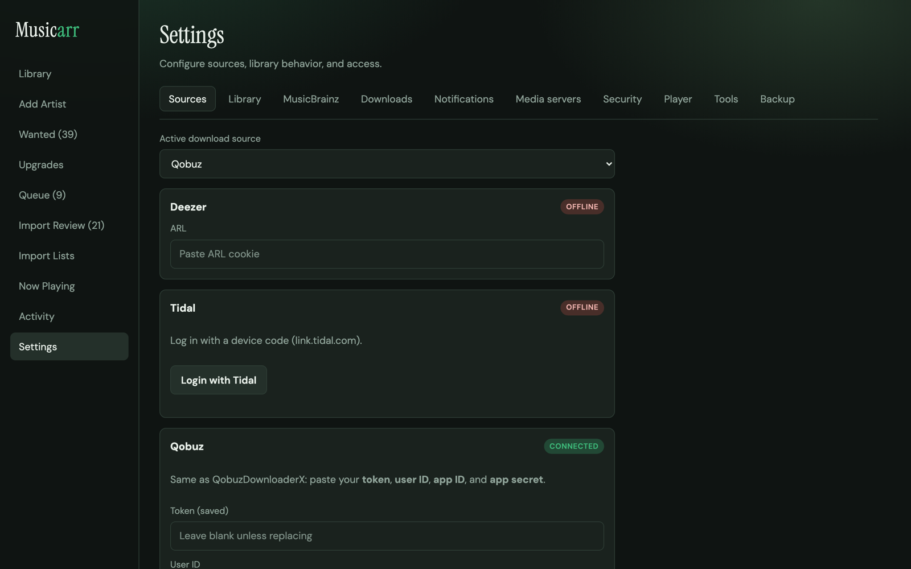

# Musicarr

**Your library. Your sources. Your rules.**

Musicarr is a self-hosted music library manager with a sharp, modern web UI. Point it at
**Deezer**, **Tidal**, or **Qobuz**, follow the artists you care about, and it keeps your
FLAC library filled in automatically — plus an optional multi-user listening room at `/player`
so the people you share it with never need their own accounts on the source services.

[](https://github.com/PineDev1/Musicarr/releases/latest)
[](https://github.com/PineDev1/Musicarr/pkgs/container/musicarr)
[](#license--liability)

**Author:** [PineDev1](https://github.com/PineDev1)

---

## Screenshots

<table>
<tr>
<td width="50%">

<p align="center"><sub>Library — every followed artist, at a glance</sub></p>
</td>
<td width="50%">

<p align="center"><sub>Artist page — wanted, downloaded, and skipped releases</sub></p>
</td>
</tr>
<tr>
<td width="50%">

<p align="center"><sub>Live download queue with per-track collaborator credits</sub></p>
</td>
<td width="50%">

<p align="center"><sub>Tabbed settings — sources, library, MusicBrainz, security, player</sub></p>
</td>
</tr>
</table>

---

## Why Musicarr

- **One active download source, three providers ready when you are** — switch between Deezer, Tidal, and Qobuz without re-adding your library.
- **Import the collection you already own**, then let Musicarr fill in the gaps.
- **Collaborations are handled properly** — a feature credit shows up under every artist involved, not just the primary one.
- **Optional multi-user music player** at `/player` with lossless streaming — FLAC stays FLAC, no server-side transcoding.
- **Optional login + Traefik HTTPS** for the moment you take it off the LAN.
- **One Docker container.** Open `http://localhost:8787` and go.

---

## Features

| Category | What you get |
|---|---|
| **Multi-source downloads** | Deezer (ARL), Tidal (device login), or Qobuz (token / app credentials). One active source at a time; switch anytime. |
| **Artist library** | Search, add, and monitor artists. Diacritic- and article-aware matching means "The Beatles" and "Beatles" resolve correctly. |
| **Collaboration credits** | Featured-artist releases are correctly linked and shown under every credited artist's page — even when MusicBrainz has more than one ID for the same artist. |
| **Wanted / Queue / Activity** | Track missing albums, live download progress, and a full history of what happened and when. |
| **Quality & naming** | FLAC / 320 / 128 targets, automatic upgrade flags, and custom folder/track templates. |
| **Artist monitor profiles** | All albums, new-only, or unmonitored — with a per-artist singles override. |
| **Import existing library** | Point Musicarr at music you already have; it tags, links, and marks it downloaded. |
| **Import review** | After an import, link local-only artists and clean up weakly tagged albums. |
| **Import lists** | Paste a list of artist names, set a refresh interval, and Musicarr adds any that go missing from your library. |
| **Multi-provider fallback** | If your active source doesn't have an album, Musicarr can automatically try your other configured sources before giving up. |
| **Release monitor** | Scheduled and on-demand "Scan for new music." |
| **Backup & restore** | One-click export of settings and library metadata (secrets excluded); guided restore. |
| **Media server hooks** | Refresh Plex, Jellyfin, Navidrome, or a generic webhook after downloads/imports. |
| **Multi-user music player** | `/player` — its own logins, playlists, drag-and-drop queue, wavy seek bar, smart mixes, and lossless streaming. |
| **Admin Now Playing** | See who's listening, live, and force-pause a session. |
| **Guided setup wizard** | First run walks you through sources, library path, and (optionally) the player. |
| **Docker-first deploy** | Single container, single process, web UI on port `8787`. |

## Download sources

| Provider | Auth | Notes |
|----------|------|-------|
| Deezer | ARL cookie | FLAC needs a HiFi-capable account |
| Tidal | Device link login | Premium typically required |
| Qobuz | Token + user ID + app ID + app secret | Same style as QobuzDownloaderX; email/password optional |

---

## Requirements

- Docker + Docker Compose **(recommended)**, **or**
- Python 3.12+, Node.js 22+ (local development)

---

## Install with Docker (recommended)

### 1. Clone

```bash
git clone git@github.com:PineDev1/Musicarr.git
cd Musicarr
```

### 2. Start

```bash
docker compose up -d --build
```

Open **http://localhost:8787** — the setup wizard walks you through the rest.

> Musicarr is designed as a **single process** (one container / one `uvicorn` worker). Do not
> run multiple workers or replicas against the same SQLite database — downloads and the
> release monitor are in-process and would race.

### 3. Volumes

| Host path | Container | Purpose |
|-----------|-----------|---------|
| `./data`  | `/config` | SQLite DB, settings, download staging |
| `./music` | `/music`  | Your music library |

Point Musicarr's library path at `/music` inside the container (default), or mount a different host folder:

```yaml
volumes:
  - /path/on/host/Music:/music
```

### 4. Update

```bash
git pull
docker compose up -d --build
```

Or pull the prebuilt image:

```bash
docker pull ghcr.io/pinedev1/musicarr:latest
```

### 5. Logs / stop

```bash
docker compose logs -f musicarr
docker compose down
```

### 6. Reverse proxy (Traefik)

Musicarr does **not** terminate TLS itself. Put Traefik (or another reverse proxy) in front and keep Musicarr on port `8787`.

1. Point DNS at Traefik and route `Host(\`music.example.com\`)` to the Musicarr service (port **8787**).
2. Example compose file: [`docker-compose.traefik.yml`](docker-compose.traefik.yml) (expects an external Docker network named `proxy`).
3. In **Settings → Security**:
   - Enable **app login** before exposing off your LAN
   - Enable **Behind HTTPS (Traefik terminates SSL)**
   - Set **Public domain** to the same hostname (e.g. `music.example.com`)
4. Copy the generated Traefik labels from that page if you are not using the example compose file.

With HTTPS mode on, Musicarr sets `Secure` session cookies so form login works through Traefik.

---

## Music player

Optional listening UI at **`/player`** — completely separate from the admin library manager.

1. In **Settings → Player**, enable **Enable music player**.
2. Create listener users (username + password). These are **not** the admin login.
3. Open `http(s)://your-host:8787/player` and sign in.
4. Browse with cover art, like tracks, use built-in mixes (Liked / Recently Added / Recently Played / Shuffle Mix), and create playlists with the **+** button.
5. Playback uses a floating pill bar with an **Android 13–style wavy seek scrubber** (customize under player Settings). Drag-and-drop to reorder the queue. Smart playlists suggest similar songs after you seed 10 tracks.

**Admin:** **Now Playing** in the main sidebar shows active listeners and can **Stop** (force-pause) their playback.

**Quality:** Musicarr streams the **original file bytes** (HTTP Range for seeking). FLAC stays FLAC — no server-side transcode or downsample.

Player users cannot download, manage Wanted/Queue, or change admin settings.

---

## Backup & restore

**Settings → Backup** exports your settings and library metadata (artists, albums, tracks,
history) as a downloadable archive. Provider credentials, tokens, and password hashes are
**never included** — only a redacted settings file plus a snapshot of the database.

Restoring validates and stages the archive before touching anything live, then asks you to
restart Musicarr to load it — this avoids swapping the database out from under an
in-progress download or the release monitor.

---

## Import an existing library

1. In **Settings**, set **Library path** to the folder that already contains your music
   (e.g. `Artist/Album/01 - Track.flac`).
2. Click **Import existing library**.
3. Musicarr reads tags (and folder names as fallback), creates artists/albums/tracks, marks them
   downloaded, and when possible links artists to your **active** download source so you can
   grab missing releases later.
4. Open **Review imports** to link local-only artists to your active source and check weakly tagged
   albums.
5. Use **Match files to library** anytime to re-link files to artists you already added in Musicarr
   without creating new entries.

Supported audio: `.flac` `.mp3` `.m4a` `.ogg` `.opus` `.wav` `.aac` `.aiff`

- Folders: `{artist}/{album} ({year})`
- Tracks: `{track:02d} - {title}`

---

## Quick start (first run)

1. Open the UI → the setup wizard prompts for a download source (Deezer / Tidal / Qobuz) and your library path.
2. Optionally enable **app login** and **HTTPS / Traefik** under **Settings → Security**.
3. Optionally enable the **Player** tab and create listener accounts.
4. **Add Artist** → Musicarr syncs releases and can queue missing albums.
5. Or **Import existing library** if the files are already on disk.

---

## Troubleshooting

**The site is stuck loading in one browser but works in another.**
This is almost always a stale Service Worker from a previous version, not a server
problem. In DevTools → **Application** → **Service Workers**, click **Unregister**, then
**Clear storage** → **Clear site data**, then hard-refresh (Cmd/Ctrl+Shift+R).

**Nothing loads at all, in any browser.**
Confirm you're using `http://`, not `https://`, unless you've put Musicarr behind Traefik
with HTTPS mode enabled — a browser trying to negotiate TLS against a plain HTTP port will
hang indefinitely. Then check `docker compose logs -f musicarr` for a startup error.

**A download won't cancel / the UI feels sluggish under load.**
Fixed as of v1.7 — update to the latest image. If it recurs, check
`docker compose logs -f musicarr` for repeated `UNIQUE constraint failed` or
`database is locked` errors and open an issue with the surrounding log lines.

---

## Local development

```bash
# Backend
cd backend
python3 -m venv .venv
source .venv/bin/activate   # Windows: .venv\Scripts\activate
pip install -r requirements.txt
python run.py
```

API: http://127.0.0.1:8787 · Docs: http://127.0.0.1:8787/docs

### Frontend (hot reload)

```bash
cd frontend
npm install
npm run dev
```

Vite: http://127.0.0.1:5173 (proxies `/api` to the backend).

Production UI into `backend/static`:

```bash
cd frontend && npm run build
```

### Running tests

```bash
cd backend
.venv/bin/python -m pytest -q
```

---

## Branches

| Branch | Purpose |
|--------|---------|
| `main` | Stable / releases |
| `dev` | Active development |

---

## What's coming (v2.0)

v2.0 moves Musicarr from a download manager toward a **library OS**.

| Milestone | Focus |
|-----------|--------|
| **2.0a** | Metadata brain (MusicBrainz / ISRC-first) + stronger rematch/import review |
| **2.0b** | Multi-root library paths + tag/cover writeback |
| **2.0c** | Provider fallback for grab/upgrade *(shipped early in v1.7)* |
| **2.0d** | Release calendar / discover, denser UI |

**Pillars:** canonical metadata separate from provider IDs; multiple library roots; smarter fulfillment across Deezer/Tidal/Qobuz; consistent tags & artwork; remote-ready access; backup/restore *(shipped in v1.7)*; UI leap.

**Not planned as v2.0 flagships:** full SSO / enterprise identity, or Spotify/YouTube download sources.

---

## Releases

See the [Releases page](https://github.com/PineDev1/Musicarr/releases) for the full changelog on every version.

Images: `ghcr.io/pinedev1/musicarr:<version>` · `ghcr.io/pinedev1/musicarr:latest`

---

## Contributing / support

Issues and pull requests are welcome — please include steps to reproduce, relevant logs
(`docker compose logs -f musicarr`), and your Musicarr version for bug reports. This is a
one-person hobby project maintained in spare time; there's no SLA on response time.

---

## Security notes

- Do **not** commit `data/`, `.env`, ARL cookies, Qobuz tokens, or app secrets.
- Prefer Docker volumes with permissions only you can read.
- Rotate provider credentials if they leak.
- If you expose Musicarr through Traefik or another public hostname, enable **app login** and **HTTPS / Traefik mode** under Settings → Security.

---

## License / liability

No warranty. Use at your own risk. The author (**PineDev1**) accepts **no liability** for any use of this software.

---

## Legal disclaimer

**Musicarr is provided "as is", without warranty of any kind, express or implied.**

By using this software you acknowledge and agree that:

1. **You alone are responsible** for how you use Musicarr, including compliance with the terms of service of Deezer, Tidal, Qobuz, and any other third party, as well as all applicable local copyright and intellectual-property laws.
2. Downloading or copying copyrighted music without authorization from the rights holder **may be illegal** in your jurisdiction and/or a violation of a streaming service's terms.
3. **PineDev1 / the author / contributors hold no accountability** for misuse, account bans, legal claims, damages, data loss, or any other consequence arising from use of this project.
4. Credentials you paste into Musicarr (ARL cookies, tokens, app secrets, etc.) are stored **on your machine**. Protect them. Never commit them to git or share them publicly.
5. This software is intended for **personal, local use** on libraries you are legally entitled to manage. The author does not encourage or endorse piracy.

**If you do not agree, do not use Musicarr.**
